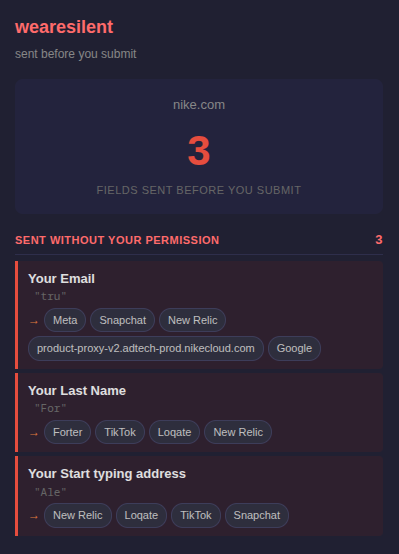
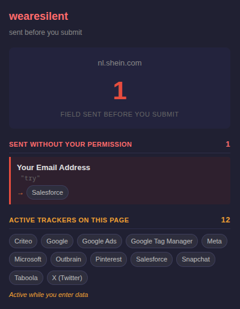

# wearesilent

> Your form data is being sent before you click submit. This extension shows you where it goes.

You're still typing your email into a login form, but a script already read the field and fired it to a third-party server. A [USENIX 2022 study](https://www.usenix.org/conference/usenixsecurity22/presentation/senol) found 2,950 of the top 100,000 websites leak form data before submission. wearesilent makes this visible — showing exactly which fields are leaked to which companies, in real time.

No cloud. No AI. Everything runs locally in your browser.




## What it looks like

The popup has two independent sections:

**Sent without your permission** (red) — confirmed leaks where your typed values were found inside cross-origin network requests:

```
nike.com
         1
field sent before you submit

SENT WITHOUT YOUR PERMISSION                    1
┌──────────────────────────────────────────────┐
│ Your Start typing address                    │
│ "hwrhh"                                      │
│ → [Loqate]                                   │
└──────────────────────────────────────────────┘

ACTIVE TRACKERS ON THIS PAGE                    3
[Forter]  [Loqate]  [New Relic]
Active while you enter data
```

**Active trackers on this page** (amber) — known third-party tracker companies detected making requests while form fields are present.

## What it catches

| Vector | Example |
|---|---|
| Address autocomplete services | Loqate/Addressy reading keystrokes in address fields |
| Fraud detection | Forter collecting field data for risk scoring |
| Session replay tools | FullStory, Hotjar, Mouseflow reading input fields |
| Marketing pixels | Meta Pixel, TikTok Pixel capturing email/name fields |
| CRM/chat widgets | Sierra AI, Salesforce reading email fields |
| Analytics scripts | Google Analytics, Amplitude exfiltrating search queries |
| Abandoned cart tracking | Klaviyo, Shopify capturing partially-typed email |
| APM/monitoring | New Relic collecting page interaction data |

## Try It Now

Store approval pending — install locally in under a minute:

### Chrome
1. Download this repo (Code → Download ZIP) and unzip
2. Go to `chrome://extensions` and turn on **Developer mode** (top right)
3. Click **Load unpacked** → select the `chrome-extension` folder
4. That's it — browse any site and click the extension icon

### Firefox
1. Download this repo (Code → Download ZIP) and unzip
2. Go to `about:debugging#/runtime/this-firefox`
3. Click **Load Temporary Add-on** → pick any file in the `firefox-extension` folder
4. That's it — browse any site and click the extension icon

> Firefox temporary add-ons reset when you close the browser — just re-load next session.

---

## The weare____ Suite

Privacy tools that show what's happening — no cloud, no accounts, nothing leaves your browser.

| Extension | What it exposes |
|-----------|----------------|
| [wearecooked](https://github.com/hamr0/wearecooked) | Cookies, tracking pixels, and beacons |
| [wearebaked](https://github.com/hamr0/wearebaked) | Network requests, third-party scripts, and data brokers |
| [weareleaking](https://github.com/hamr0/weareleaking) | localStorage and sessionStorage tracking data |
| [wearelinked](https://github.com/hamr0/wearelinked) | Redirect chains and tracking parameters in links |
| [wearewatched](https://github.com/hamr0/wearewatched) | Browser fingerprinting and silent permission access |
| [weareplayed](https://github.com/hamr0/weareplayed) | Dark patterns: fake urgency, confirm-shaming, pre-checked boxes |
| [wearetosed](https://github.com/hamr0/wearetosed) | Toxic clauses in privacy policies and terms of service |
| **wearesilent** | Form input exfiltration before you click submit |

All extensions run entirely on your device and work on Chrome and Firefox.
